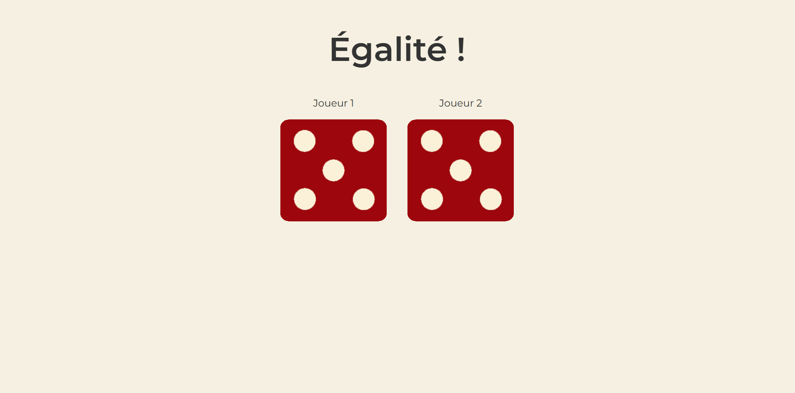

# 🎲 Dice Game

[]()

FRENCH VERSION - A simple dice mini-game built with HTML, CSS, and JavaScript. Each time the page is refreshed, two dice display random values. The player with the highest roll wins!

## ✨ Features

- **Automatic Dice Roll:** Random numbers are generated every time the page is reloaded.
- **Visual Dice Display:** Dice are represented with images corresponding to their values.
- **Winner Detection:** Displays which player wins or if it’s a draw.
- **Responsive Design:** Works well on desktops, tablets, and mobile devices.
- **Lightweight and Beginner-Friendly:** Great for learning front-end web development basics.

## 🛠️ Technologies Used

- **Frontend:**

  - HTML
  - CSS
  - JavaScript

- **Other:**
  - No external libraries required
  - Git for version control

## 🚀 Installation & Usage

1. **Clone the repository:**

   ```bash
   git clone https://github.com/Antoinekoe/dice-game.git
   cd dice-game
   ```

2. **Open the HTML file in your browser:**

   Simply open `index.html` directly or use a local development server (e.g. Live Server extension in VS Code).

## 🗂️ Project Structure

```
dice-game/
├── img/ # Dice images (dice1.png to dice6.png)
├── index.html # Main HTML file
├── style.css # CSS styling
├── index.js. # JavaScript logic for dice rolling and winner detection
├── LICENSE # License file
└── README.md # This file
```

## 🤝 How to Contribute

Contributions are welcome! To contribute:

1. **Fork the repository**
2. **Create a new branch:**

   ```bash
   git checkout -b feature/new-feature
   ```

3. **Make your changes**
4. **Push your branch:**

   ```bash
   git push origin feature/new-feature
   ```

5. **Open a Pull Request to the `main` branch**

## 🔧 Potential Improvements (TODO)

- Add a "Roll Again" button (no need to reload the page).
- Add a score counter for each player.
- Animate dice rolls.
- Add sound effects.
- Improve visual theme with custom styles.

## 🔑 License

This project is licensed under the MIT License – see the [LICENSE](LICENSE) file for details.
